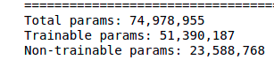
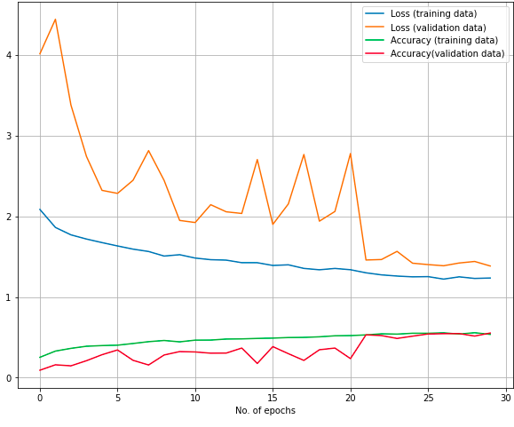
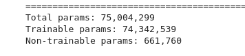
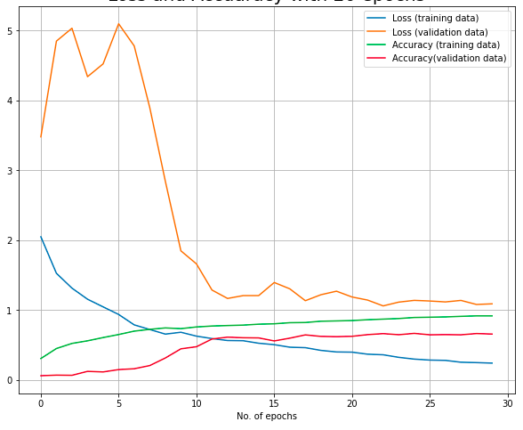

# CAN YOU PREDICT THE ARTISTS BASED ON THEIR PAINTING STYLE?

## Introduction
Painting is all about the expression of ideas and emotions, with the creation of certain aesthetic qualities. The elements of this language—its shapes, lines, colours, tones, and textures—are used in various ways to produce sensations of volume, space, movement, and light on a flat surface. These elements are combined into expressive patterns in order to represent real or supernatural phenomena, to interpret a narrative theme, or to create wholly abstract visual relationships. Three of the most recognizable images in Western art history are paintings: Leonardo da Vinci’s Mona Lisa, Edvard Munch’s The Scream and Vincent van Gogh’s The Starry Night. These three art works are examples of how painting can go beyond a simple mimetic function, that is, to only imitate what is seen. The power in great painting is that it transcends perceptions to reflect emotional, psychological, even spiritual levels of the human condition. BUT WAIT A SECOND? How accurate you can predict the artist based on a given painting. At least for me, not that accurate unless I have seen all the paintings and memorize which of them belong to which artist. So, I decided to build a machine learning model to predict the artist based on their painting style.

## Data
The data set, I have fed into my convolutional neural network(CNN) came from kaggle (https://www.kaggle.com/ikarus777/best-artworks-of-all-time). I just want to take a moment and thanks the person for doing all the hard work, collecting those paintings and making this dataset widely available on kaggle. This data set is about paintings from 50 different artists, and data is not evenly spread out between each artists. So, I decided to filter out only 11 different artists who had more than 200 paintings. Why 200? It is about right amount of data to do transfer learning.

## Workflow
Since the data set is not big enough to train a CNN from scratch, I knew straight away that I had to do transfer learning in order to make better predictions. For some reason, I decided to go with ResNet50 pretrained model. However, I have tried other pretrained models like VGG-16 and Inceptionv3, but they all endup being as good as ResNet50. After a couple of tries, I came up with a somewhat working model which I will talk about it in below section. 

### straight into transfer learning and my first working model
My intention was to get a somewhat working model which I decided to freeze every single layer in the pretrained model and add three more dense layers of mine, one with 512, other with 16 nodes and final output layer toward the end of pretrained model. The data is not very well spread out. So, it is important to make your model pay more attention to samples from an under-represented class. Result has shown in below graph.

  

  

As you can see trainable parameters are down to 51 millions. I ran my transfer learning model for about 30 epochs and validation accuracy wind up being around 55. However, you can still see that my model is still learning. Is it worth let it run for another few epochs and see how it does? well, I decided to move on to fine tuning whch I will talk about it next section.

### Fine tuning
Without wasting time and computing power I started fine tuning my model which did not go as I planed. This time, I only freezed first 50 layers in the pretrained model. As you can see in below picture, trainable parameters are insanely high, and it does not come without a cost. Model can easily overfit as I am trying to train a much larger model and want to readapt the pretrained weights. Any solutions? I have reduced the learing rate from 0.001 to 0.0001

  

  

I have trained this model about 30 epochs and result has shown in the above graph. I would say this is a good start but my fine tuning did not go as planed. Take a closer look at the graph, validation accuracy kind of plateaued out after ceratain number of epochs. We can regularize our model to prevent overfitting and let it run few epochs or we can unfreezed more layers of the pretrained model see how well it does.

### Surprise fine tuning.

### conclusion:
It seems like my model start overfitting after a certain number of epochs. I have regularized my model to be more flexible, but have not seen any progress. I was looking at what I can do next. First things, that came to mind was that I do not have enough data to deal with in the training dataset(100 images per species). Unfortunately, there was nothing I could do about that. Then, I went back to see my actual data, and found out that the data is not always about a picture of one monkey. Some pictures are about bunch of monkeys. Then, I start isolating pictures of one monkey.

 BatchNormalization layer will run in inference mode, and will not update its mean and variance statistics.
As you are training a much larger model and want to readapt the pretrained weights, it is important to use a lower learning rate at this stage. Otherwise, your model could overfit very quickl
