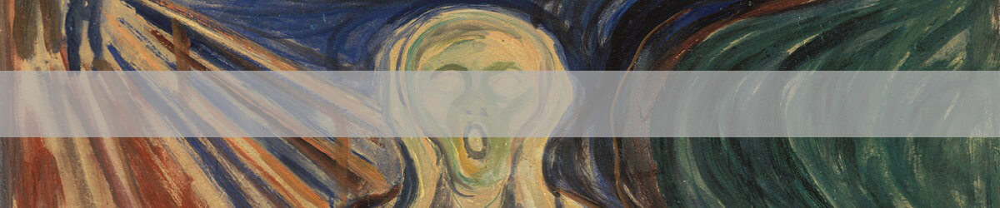

# CAN YOU PREDICT THE ARTISTS BASED ON THEIR PAINTING STYLE?

## Introduction
Painting is all about the expression of ideas and emotions, with the creation of certain aesthetic qualities. The elements of this language—its shapes, lines, colours, tones, and textures—are used in various ways to produce sensations of volume, space, movement, and light on a flat surface. These elements are combined into expressive patterns in order to represent real or supernatural phenomena, to interpret a narrative theme, or to create wholly abstract visual relationships.

Three of the most recognizable images in Western art history are paintings: Leonardo da Vinci’s Mona Lisa, Edvard Munch’s The Scream and Vincent van Gogh’s The Starry Night. These three art works are examples of how painting can go beyond a simple mimetic function, that is, to only imitate what is seen. The power in great painting is that it transcends perceptions to reflect emotional, psychological, even spiritual levels of the human condition. BUT WAIT A SECOND? How accurate you can predict the artist based on a given painting. At least for me, not that accurate unless I have seen all the paintings and memorize which of them belong to which artist. So, I decided to build a machine learning model to predict the artist based on their painting style.

## Data
The data set, I have fed into my convolutional neural network(CNN) came from kaggle (https://www.kaggle.com/ikarus777/best-artworks-of-all-time). I just want to take a moment and thanks the person for doing all the hard work, collecting those paintings and making this dataset widely available on kaggle.

write a para how did you come up with 11 artists.
